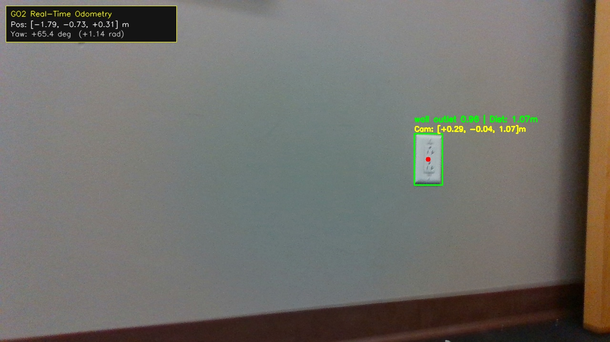

# Unitree Go2 Real-Time Pipeline for Semantic Segmenation and Spatial Landmark Mapping 


## Overview
An end-to-end spatial perception, open-vocabulary semantic detection, and 3D landmark mapping pipeline deployed on the **Unitree Go2 quadruped** equipped with an **Intel RealSense D435i** depth camera.

This system detects target environmental fixtures (e.g., electrical outlets, switches, infrastructure markers) in real time, back-projects 2D image coordinates into 3D metric camera space using hardware-aligned depth and camera intrinsics, transforms detections into a globally consistent coordinate frame via onboard LiDAR-inertial odometry (`utlidar`), and performs online spatial clustering to generate a persistent 3D landmark map.

## Repository Structure
```
go2-spatial-vision-mapping/
├── README.md
├── requirements.txt
├── config/
│   └── cyclonedds.xml                       # CycloneDDS multi-interface configuration
├── nodes/
│   ├── go2_rs_localizer_segmentation.py     # Main RGB-D perception & back-projection node
│   ├── go2_outlet_plotter.py                # Spatial gating, online clustering, & JSON exporter
│   ├── vid_stream_server.py                 # HTTP MJPEG browser stream server (Port 8080)
│   └── go2_map_validator.py                 # Client script querying BIM validation server
├── mapping_validation_server/
│   ├── requirements_server.txt              # FastAPI, Uvicorn, Pydantic dependencies
│   └── server_app/
│       └── main.py                          # FastAPI BIM validation service (Port 8000)
├── outlet_maps/
│   └── lab_outlets_map.json                 # Exported room landmark registry database
└── samples/
    ├── realsense_spatial_outlet_sample.jpg   # Annotated perception capture with 3D coordinates
    └── lab_outlets_map_sample.json          # Benchmark dataset output
```

## Core Features & Implementation
- **Open-Vocabulary Semantic Detection:** Leverages **YOLO-World** for zero-shot text-prompted target detection, bypassing fixed dataset label limitations.
- **Hardware-Synchronized RGB-D Back-Projection:** Ingests aligned 1080p RGB and 16-bit depth streams (`ApproximateTimeSynchronizer`), applying central-ROI median filtering to suppress specular depth dropouts and computing metric $(X_c, Y_c, Z_c)$ optical vectors.
- **Dynamic Coordinate Frame Transformation:** Fuses camera-relative 3D vectors with high-frequency ($\sim150\text{ Hz}$) onboard LiDAR-inertial odometry (`/utlidar/robot_odom`), anchoring detections to a persistent global map frame.
- **Online Recursive Spatial Clustering:** Employs Euclidean neighborhood gating ($d \le 0.25\text{ m}$) and online running centroid averaging ($\mathcal{O}(1)$ memory) to merge multi-frame observations and reject transient false positives.
- **Live Visual Telemetry & Persistent Export:** Streams real-time annotated video with dynamic odometry heads-up display (HUD) over HTTP MJPEG and serializes verified fixtures to a structured `lab_outlets_map.json` database.

## Pipeline System Architecture 
```
INTEL REALSENSE D435i
               ┌─────────────────────────────┐
               │  RGB8 Stream (1280x720)     │
               │  Aligned Depth (Z16)        │
               │  Camera Intrinsics Matrix K │
               └──────────────┬──────────────┘
                              │
                              ▼
┌─────────────────────────────────────────────────────────────────┐
│ Node 1: go2_rs_spatial_localizer.py                             │
│  ├─ Time Synchronization (ApproximateTimeSynchronizer <= 80ms)  │
│  ├─ Zero-Shot Detection (YOLO-World on cuda:0)                  │
│  ├─ Central-ROI Median Depth Extraction (Z_c)                   │
│  ├─ Pinhole Ray Back-Projection -> (X_c, Y_c, Z_c)              │
│  └─ Global Map Frame Transformation via /utlidar/robot_odom     │
└─────────────────┬─────────────────────────────┬─────────────────┘
                  │                             │
Topic: /go2_camera/segmented_overlay/compressed │ Topic: /go2_vision/detected_outlet_position
                  │                             │
                  ▼                             ▼
┌──────────────────────────────┐  ┌────────────────────────────────┐
│ Node 2: vid_stream_server.py │  │ Node 3: go2_outlet_plotter.py  │
│  └─ HTTP MJPEG Stream        │  │  ├─ Euclidean Gating (<25cm)   │
│     (Port 8080 Browser HUD)  │  │  ├─ Recursive Mean Centroid    │
└──────────────────────────────┘  │  ├─ Confirmation Gate (N>=100) │
                                  │  ├─ RViz 3D Marker Broadcast   │
                                  │  └─ Auto-Dump to JSON Map      │
                                  └────────────────────────────────┘
                                                 │                                           
                                                 │                            
                                                 ▼   
                                  ┌───────────────────────────────┐
                                  │ Node 4: go2_map_validator.py  │
                                  │  ├─ Runs periodically         │
                                  │  ├─ Parses JSON               │
                                  │  ├─ Packages confirmed entries│
                                  │  ├─ Inbounds outlet data      │
                                  |     ├─ to validation server   |
                                  │                               |
                                  └───────────────────────────────┘
                                                 │                                           
                                                 │  (Port 8000)                            
                                                 ▼   
                                  ┌───────────────────────────────┐     (Intended Server-Side)
                                  │ FastAPI Validation Server     │
                                  │  ├─ Ingests JSON payload      │
                                  │  ├─ Queries DB for room info  │
                                  │  ├─ Discriminates w/ tolerance│
                                  │    ├─ (<= +-0.50)             │
                                  |  ├─ Derives map entry metrics |
                                  │  └─ Returns verdict to Go2    |
                                  └───────────────────────────────┘
```

## ROS2 Node and Topic Flow
```
┌────────────────────────────────────────────────────────────────────────────────────────────────────────┐
│                                   UNITREE GO2 ONBOARD ROBOT (Edge ROS 2)                               │
│                              Sensors, Odometry Hardware                                                │
│   [ Intel RealSense D435i ]                      [ Unitree Integrated IMU ]                            │
│   ├── /camera/camera/color/image_raw             └── /utlidar/robot_odom                               │
│   │   (sensor_msgs/Image - 1280x720 RGB8)            (nav_msgs/Odometry - 150 Hz)                      │
│   └── /camera/camera/aligned_depth_to_color/image_raw          │                                       │
│       (sensor_msgs/Image - 16-bit Z16 Depth)                   │                                       │
│                │                                               │                                       │
│                └───────────────────────┬───────────────────────┘                                       │
│                                        ▼                                                               │
│   ┌────────────────────────────────────────────────────────────────────────────────────────────────┐   │
│   │ Node 1: go2_rs_spatial_localizer.py                                                            │   │
│   │ • Time Sync: ApproximateTimeSynchronizer (slop <= 80ms)                                        │   │
│   │ • Open-Vocabulary Semantic Detection: YOLO-World (cuda:0)                                      │   │
│   │ • Depth Sampling: Central-ROI Median Filter -> (X_c, Y_c, Z_c)                                 │   │
│   │ • Spatial Transform: Extrinsic Mount Offsets + Body Frame Yaw Rotation                         │   │
│   └─────────────────┬────────────────────────────────────────────┬─────────────────────────────────┘   │
│                     │                                            │                                     │
│                     ▼ Topic: /go2_camera/segmented_overlay/comp  ▼ Topic: /go2_vision/detected_outlet  │
│                       (sensor_msgs/CompressedImage)                (geometry_msgs/PointStamped)        │
│                     │                                            │                                     │
│                     ▼                                            ▼                                     │
│   ┌─────────────────────────────────────┐      ┌───────────────────────────────────────────────────┐   │
│   │ Node 2: vid_stream_server.py        │      │ Node 3: go2_outlet_plotter.py                     │   │
│   │ • Ingests annotated JPEG stream     │      │ • Spatial Gating: Euclidean Neighborhood (d<0.25m)│   │
│   │ • Renders real-time HUD telemetry   │      │ • Centroid Mean: Online Recursive Accumulation    │   │
│   │ • Web Server: Port 8080 (MJPEG)     │      │ • Gate: N >= 100 observations to confirm          │   │
│   └─────────────────┬───────────────────┘      │ • Exporter: Periodic Map Dump (1 Hz)              │   │
│                     │                          └─────────────────┬─────────────────────────────────┘   │
│                     │                                            │                                     │
└─────────────────────┼────────────────────────────────────────────┼─────────────────────────────────────┘
                      │ HTTP Video Stream                          ▼ Disk Serialization
                      ▼ (Port 8080)                        outlet_maps/lab_outlets_map.json
                [ Browser HUD ]                                    │
                                                                   ▼
                                                  ┌───────────────────────────────────────────────────┐
                                                  │ Client Trigger: go2_map_validator.py              │
                                                  │ • Parses confirmed landmarks from JSON            │
                                                  │ • Formulates SpatialMapValidationPayload          │
                                                  └─────────────────┬─────────────────────────────────┘
                                                                    │
                                                                    ▼ HTTP POST /validate/landmarks
                                                  ┌───────────────────────────────────────────────────┐
                                                  │ FASTAPI BIM VALIDATION SERVER (Port 8000)         │
                                                  │ • Queries Architectural Database (ROOM_BIM_DB)    │
                                                  │ • Spatial Distance Gating (Tolerance <= 0.50m)    │
                                                  │ • Computes Error Residuals & Verification Verdict │
                                                  └───────────────────────────────────────────────────┘
```


## Core Topics and Message Types (Outdated)
### Pipeline Nodes:
- `go2_rs_localizer_segmentation`
- `go2_outlet_plotter`
- `vid_stream_server`
- `go2_map_validator`

### Topics:
- `/go2_camera/image_raw`
- `/go2_camera/image_raw/compressed`
- `/go2_camera/segmented_overlay`
- `/go2_camera/segmented_overlay/compressed`


## Embedded Systems, Hardware
- **Robot Platform:** Unitree Go2 Quadruped (Perception Unit: NVIDIA Jetson Orin / Xavier NX, Ubuntu 20.04 / 22.04)
- **Perception Sensor:** Intel RealSense D435i Depth Camera (USB 3.2)
- **Middleware:** ROS 2 (Foxy) & Eclipse CycloneDDS (`rmw_cyclonedds_cpp`)
- **Computer Vision & ML:** PyTorch (CUDA-accelerated), Ultralytics YOLO-World, OpenCV, NumPy

## Installation and Configuration
### CycloneDDS Environment
- WIP
### Dependency Installation
```
# Python perception dependencies
pip3 install ultralytics opencv-python numpy requests

# Server verification dependencies
pip3 install -r mapping_validation_server/requirements_server.txt
```
#### Validate PyTorch Communication with GPU
```
python3 -c "import torch; print(f'CUDA Available: {torch.cuda.is_available()} | Device: {torch.cuda.get_device_name(0)}')"
```
### Pipeline Initialization Via Multi-Terminal Execution
#### Video Data Stream and Hardware Drivers
**Terminal 1: RealSense RGB-D Hardware Driver**
```
ros2 launch realsense2_camera rs_launch.py \
    align_depth.enable:=true \
    enable_sync:=true \
    rgb_camera.profile:=1280x720x30 \
    depth_module.profile:=1280x720x30
```
**Terminal 2: RT Video Data and Telemetry Server**
```
cd ~/projects/vision_backend
python3 nodes/vid_stream_server.py
```

**Terminal 3: Localizer and Segmentation with Integrated Video Data Stream Bridge**
```
cd ~/projects/vision_backend
export QT_QPA_PLATFORM=offscreen
python3 nodes/go2_rs_localizer_segmentation.py
```

**Terminal 4: RBG-D & Telemetry Server**
```
cd ~/projects/vision_backend
python3 nodes/vid_stream_server.py
```

**Terminal 5: BIM Validation Demonstrator Server**
```
cd ~/projects/vision_backend/mapping_validation_server
uvicorn server_app.main:app --host 0.0.0.0 --port 8000
```

**Terminal 6: Client Map Validation Transmitter**
- Creates payload of candidate outlets to be sent as a query to the validation server
- Run script to manually trigger validation query only when room scan complete
```
cd ~/projects/vision_backend/nodes
python3 go2_map_validator.py
```

## Sample Payload and JSON Entries
### Serialized Outlet Map Header and Entry
```
{
  "coordinate_frame": "map",
  "total_confirmed_outlets": 2,
  "outlets": [
    {
      "id": "outlet_01",
      "class": "power_outlet",
      "position_meters": {
        "x": -2.417,
        "y": 2.492,
        "z": 0.285
      },
      "total_observations": 177,
      "confirmed": true,
      "first_detected_timestamp": 1787357983.37,
      "last_detected_timestamp": 1787357995.31
    }
  ]
}
```

### Audit Query Response from Validation Server 
```
{
  "room_id": "lab_5428",
  "verdict": "warning",
  "timestamp": "2026-08-27T02:05:09.417Z",
  "total_expected_fixtures": 3,
  "total_detected_fixtures": 3,
  "confirmed_matches": 1,
  "missed_fixtures": ["BIM_OUTLET__02", "BIM_OUTLET__03"],
  "spurious_detections": ["outlet_08", "outlet_25"],
  "mean_spatial_error_m": 0.334,
  "match_details": [
    {
      "detected_id": "outlet_02",
      "matched_bim_id": "BIM_OUTLET__01",
      "measured_coords": {"x": -0.100, "y": -1.509, "z": 0.478},
      "bim_coords": {"x": 0.157, "y": -1.720, "z": 0.445},
      "spatial_error_m": 0.334,
      "passed": true
    }
  ],
  "message": "Partial map verification: 1/3 verified within spatial tolerance."
}
```
